## Hi there, this is Edgecoordinates 👋

**行走于世界边缘，荒原的拾荒人**

## Timeline
> Note: Things is not strictly chronological. The main purpose is to chronicle my coding journey. 

- Old times (childhood): Learned Scratch and engaged in scientific crafting when I was a child. Initiating the journey into information technology and fostering creativity.
- 2018-2019: Self-studied information competitions, gained a foundation in **algorithms** and programming languages(**c/c++**).
> In fact, my understanding of algorithms and data structures is average. I've read many algorithm books for competitive programming before, but haven't thoroughly studied and comprehended any of them, so I won't keep records.
> **Reading List:**
> [算法（第4版）](https://book.douban.com/subject/19952400/)(I really want to know why algorithm books can be so interesting.)
- February 2022: A special moment: I delved into software engineering for the first time, which provided me with an excellent tool to pursue my dreams.  
Started learning software engineering, studied **Python** and a little JS. Created [a small game](https://github.com/Edge-coordinates/Outer_space), [a **Django** library website](https://github.com/ICS-Community/ICS-Library/tree/Django_old), and [a novel **data crawling** project](https://github.com/ICS-Community/ICS-Library/tree/Django_old/Bookspider) using Python.
> I have also written some other small projects with python, and [some plugins](https://github.com/Edge-coordinates/TGbot) developed/modified for PagerMaid-Pyro have been well-received.  
> **Reading List:**
> [Python编程 : 从入门到实践（第2版）](https://book.douban.com/subject/35196328/), [Python编程快速上手（第2版）](https://book.douban.com/subject/35387685/), [Node与Express开发（第2版）](https://book.douban.com/subject/35494253/), [深入浅出React和Redux](https://book.douban.com/subject/27033213/), [Vue.js项目实战](https://book.douban.com/subject/30395202/)

- June 2022: Started learning JS and various miscellaneous topics(such as **database**). Developed some small projects and served as one of the the main member of the iFlytek tablet cracking workgroup.    
During this period, I focused on practicing and created [Lite Reader](https://github.com/Edge-coordinates/Electonrn_learning/tree/master/Lite_reader-V0.0.1) (the first generation of an unprecedented lightweight computer novel reader) and [Study_lab](https://github.com/Edge-coordinates/Electonrn_learning/tree/master/Study_Lab_ts_01) (a project mainly created for competitions, it includes the second version of the reader).   
> **Study records:**  
> - I attempted to deploy some open-source projects to **enhance my server usage skills** and submit a few issues.  
> - **JavaScript**, **TypeScript**(Only know the surface), **Electron**, **nodejs**, **express**, ORM(**Prisma**), **React**, **Vue**(Superficial understanding)  
> 
> **Reading List:** [世界观（原书第3版）](https://book.douban.com/subject/35181762/)(Recommended for everyone), [复杂](https://book.douban.com/subject/35351678/), [AI 3.0](https://book.douban.com/subject/35351678/), [JavaScript设计模式与开发实践](https://book.douban.com/subject/26382780/), [深入React技术栈](https://book.douban.com/subject/26918038/), [Electron实战：入门、进阶与性能优化](https://book.douban.com/subject/35069275/), [数据库系统概念（原书第7版）](https://book.douban.com/subject/35501216/), [计算机网络：自顶向下方法（原书第8版）](https://book.douban.com/subject/36081529/)
> 
- Miscellaneous Notes: Scripting is truly a very interesting activity! 
> [Light_tools](https://github.com/Edge-coordinates/Light_tools)some utility scripts written in Python [JS_tools](https://github.com/Edge-coordinates/JS_tools)
- June 2022: Not bad, the summer vacation is always a landmark stage. Although most of this summer vacation seems to have been spent on entertainment, I started learning **Svelte** and delved into knowledge pertaining to distributed systems. And also how to manage projects and development teams. Created [Edge_Navigation](https://github.com/Edge-coordinates/Edge_Navigation) (abandoned in the end due to being too complicated qwq) and [Waterfall_picture_viewer](https://github.com/Edge-coordinates/Waterfall_picture_viewer) (a minimalist waterfall image viewer, currently the highest-starred project).
> [A project about](https://github.com/Edge-coordinates/edge-bz) Teacher's Day. Also my first Svelte project. - **[web view](http://edge.hfbz.link/)**  
> **Reading List:**
> [MongoDB进阶与实战](https://book.douban.com/subject/35449794/), [分布式服务架构：原理、设计与实战](https://book.douban.com/subject/27091029/), [深入浅出Node.js](https://book.douban.com/subject/25768396/)(Currently reading.)

**The story continues.**

## Links

Visitors  
    